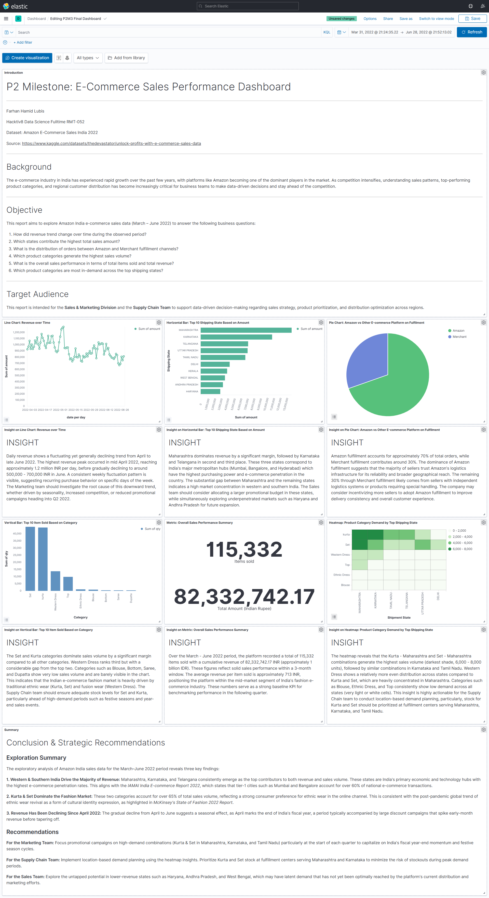

# amazon-india-sales-analytics-pipeline
ETL pipeline for Amazon India sales data using Airflow, PostgreSQL, Elasticsearch, and Kibana

## Dashboard Preview



## Repository Outline

```
1. data_raw.csv           - Original dataset sourced from Kaggle (Amazon Sale Report)
2. data_clean.csv         - Dataset after the Data Cleaning process
3. airflow_dag.py         - Apache Airflow DAG for the ETL pipeline (PostgreSQL → Cleaning → Elasticsearch)
4. data_validation.ipynb  - Data validation notebook using Great Expectations (7 Expectations)
5. ddl.txt                - DDL syntax for table creation and DML for inserting data into PostgreSQL
6. conceptual.txt         - Answers to Conceptual Problems on NoSQL, Airflow, and Batch Processing
7. dag_graph.jpg          - Screenshot of the DAG graph successfully run in Apache Airflow
8. /images                - Folder containing Kibana dashboard screenshots with insights per visualization
```

## Problem Background

E-commerce sellers in India face challenges in understanding their overall sales performance. Without data-driven analysis, business decisions such as stock management, promotional strategies, and regional expansion are often made intuitively and suboptimally. As a Data Analyst in the Business Intelligence division of an Indian e-commerce company, a report is needed to answer critical business questions such as:
- Which product categories contribute the most to total sales?
- Which sales channels are the most effective in terms of volume and transaction value?
- Which regions have the highest demand and are potential targets for expansion?
- How did sales trend over time during the March–June 2022 period?

## Project Output

This project produces an **interactive Kibana dashboard** containing 6 data visualizations with insights for each, along with strategic conclusions and recommendations directed at the Sales, Marketing, and Supply Chain divisions.

The data pipeline is built and automated using **Apache Airflow** with the following flow: PostgreSQL → Data Cleaning → Elasticsearch → Kibana.

## Data

- **Source:** [E-Commerce Sales Dataset - Kaggle](https://www.kaggle.com/datasets/thedevastator/unlock-profits-with-e-commerce-sales-data)
- **Main file:** Amazon Sale Report.csv
- **Period:** March – June 2022
- **Rows:** 128,975 rows
- **Columns:** 14 columns (selected from 24 original columns)
- **Columns used:** `order_id`, `date`, `status`, `fulfilment`, `sales_channel`, `ship_service_level`, `category`, `size`, `courier_status`, `qty`, `amount`, `ship_city`, `ship_state`, `b2b`
- **Missing values:** Handled by filling with median (numerical) and mode (categorical)
- **Duplicates:** Removed during the cleaning process

## Method

This project uses a **Batch Processing** approach with an automated ETL pipeline:

1. **Extract** – Data is retrieved from PostgreSQL using Python (psycopg2)
2. **Transform** – Data Cleaning includes: removing duplicates, normalizing column names, and handling missing values
3. **Load** – Cleaned data is loaded into Elasticsearch using the bulk helper for efficiency
4. **Validate** – Data validation using Great Expectations with 7 Expectations
5. **Visualize** – EDA is performed and visualized using the Kibana Dashboard

## Stacks

| Category | Tools / Library |
|---|---|
| Programming Language | Python 3.9 |
| Pipeline Orchestration | Apache Airflow 2.3.4 |
| Database | PostgreSQL 13 |
| Search & Analytics Engine | Elasticsearch 7.13.0 |
| Data Visualization | Kibana 7.13.0 |
| Data Validation | Great Expectations 0.18.22 |
| Containerization | Docker |
| Python Libraries | pandas, psycopg2, sqlalchemy, elasticsearch-py |

## References

- [Dataset - E-Commerce Sales Dataset (Kaggle)](https://www.kaggle.com/datasets/thedevastator/unlock-profits-with-e-commerce-sales-data)
- [Apache Airflow Documentation](https://airflow.apache.org/docs/)
- [Great Expectations Documentation](https://docs.greatexpectations.io/)
- [Elasticsearch Python Client](https://www.elastic.co/guide/en/elasticsearch/client/python-api/current/index.html)
- [Kibana Documentation](https://www.elastic.co/guide/en/kibana/current/index.html)